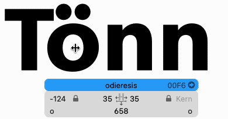

# DragToKern

Apply kerning and edit spacing by dragging glyphs with your mouse.

DragToKern is a tool plugin. Activate it by pressing the shortcut key _K_ or by
clicking the toolbar icon that shows _kTd_.

## Mouse Kerning

Just drag any glyph in your edit view to adjust its kerning.

**Tip:** If the sidebearing handles get in your way, press the **Command** key
before dragging to force the kerning mode, or lock the spacing by hitting the
_To_ icon at the bottom of the window until it has a small lock.

## Kerning Exceptions

To add or remove kerning exceptions, you can use shortcut keys. The kerning
pair on which those shortcuts operate is always the glyph at the current mouse
position and the glyph to the left of it.

- **A** – Make an exception for the right side of the left glyph
- **S** – Make an exception for the left side of the right glyph
- **D** – Make exceptions for both glyphs
- **Shift+A** – Remove the exception for the right side of the left glyph
- **Shift+S** – Remove the exception for the left side of the right glyph
- **Shift+D** – Remove the exceptions for both glyphs

This is best illustrated with an example:

Hovering over the **ö**, the shortcuts will:

- **A** – Make an exception for the **T** with the **o group**
- **S** – Make an exception for the **T group** with the **ö**
- **D** – Make exceptions for **T** with **ö**
- **Shift+A** – Remove the exception for the **T** with the **o group**
- **Shift+S** – Remove the exception for the **T group** with the **ö**
- **Shift+D** – Remove the exceptions for **T** with **ö**

## Mouse Spacing

Despite its name, you can also use this tool to change the spacing.

Hover over a glyph’s left or right edge, and red indicators will appear. Click and
drag while the indicators are shown to modify the sidebearings.

Click and drag while the **Option** key is pressed to move the glyph’s outline
inside its current width.

**Tip:** To avoid changing any kerning values accidentally while spacing, turn
off the kerning by hitting the _To_ icon at the bottom of the window until it
shows unkerned letters.

## Known issues

- If the current master’s metrics are linked to another master, dragging does
  nothing. In this case the red handles do not appear.
- Metrics keys are not considered when dragging the spacing. The linked metrics
  just go out of sync.
- Undo for metrics and kerning changes only works if you make the affected
  glyph the current glyph (e.g. by double-clicking it with the select tool)

# Copyright

© 2022 by [LucasFonts](https://www.lucasfonts.com/). Main programmer: Jens Kutílek. Licensed under the [MIT license](LICENSE).
