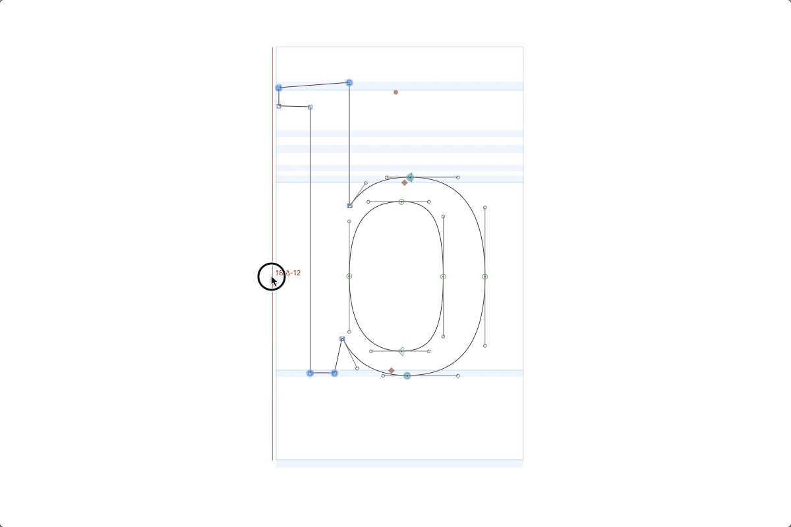

# DragToKern

Apply kerning and edit spacing by dragging glyphs with your mouse.

DragToKern is a tool plugin. Activate it by pressing the shortcut key _K_ or by
clicking the toolbar icon that shows _kT_.

Just drag any glyph in your edit view to adjust its kerning.

To add or remove kerning exceptions, you can use shortcut keys. The kerning
pair on which those shortcuts operate is always the glyph at the current mouse
position and the glyph to the left of it.

- **A** – Make an exception for the right side of the left glyph
- **S** – Make an exception for the left side of the right glyph
- **D** – Make exceptions for both glyphs
- **Shift+A** – Remove the exception for the right side of the left glyph
- **Shift+S** – Remove the exception for the left side of the right glyph
- **Shift+D** – Remove the exceptions for both glyphs

This is best illustrated with an example:

Hovering over the **ö**, the shortcuts will:

- **A** – Make an exception for the **T** with the **o group**
- **S** – Make an exception for the **T group** with the **ö**
- **D** – Make exceptions for **T** with **ö**
- **Shift+A** – Remove the exception for the **T** with the **o group**
- **Shift+S** – Remove the exception for the **T group** with the **ö**
- **Shift+D** – Remove the exceptions for **T** with **ö**

Despite its name, you can also use this tool to change the spacing by holding
any modifier keys when starting to drag:

- **Option** – Change the left sidebearing
- **Command** – Change the right sidebearing
- **Option+Command** – Move the outline inside its current width

## Known issues

- If the current master’s metrics are linked to another master, dragging does
  nothing. The linking should probably be indicated somehow when trying to
  drag.
- Metrics keys are not considered when dragging the spacing. The linked metrics
  just go out of sync.
- Undo for metrics and kerning changes only works if you make the affected
  glyph the current glyph (e.g. by double-clicking it with the select tool)

# MoveableSidebearings

Draggable sidebearings for Glyphs.app. This plugin provides an alternate method
to modify the sidebearings with the mouse. You should probably only use one or
the other plugin.

MoveableSidebearings is a reporter plugin, so it can be activated via the _View_
menu:

_View > Show Moveable Sidebearings_

Hover over the sidebearings of the active glyph and drag them to adjust.